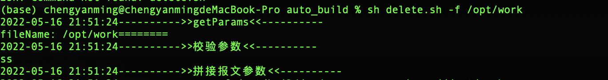

# auto_build
#### 自动构建相关脚本
## 1.delete.sh 

自动删除脚本 

    delete.sh -f /opt/work
    


## 2.cleanWorkDir.sh 
清理工作空间


    cleanWorkDir.sh -f /opt/work -t 3 

```
usage: cleanWorkDir.sh[
  [-d  --workdir]       工程路径地址 (必填)
  [-t  --retaintime]    留存时间
  ]
```

## 3.coverAgentbuild.sh 
自动部署中间件


## 4.gitbuild.sh
git自动拉java工程并mavn编译出包

```shell script
    [-u --giturl]       git 地址 (必填)
    [-b --branch]       git 需要打包的分支 default master
    [-d --buildir]      本地存放工程的路径 (必填)
    [-a --active]       构建 mvn -p @active@ default test
```
```shell script
sh gitbuild.sh -u git@xxxxx.git -b team_dev  -d /Users/sqc_coverage -a test
```

| 姓名| 年龄| 性别 | 电话|
|----: | ---- | ---- | ------------ |
| 张三 | 18 | 男 | 123456789121 |
